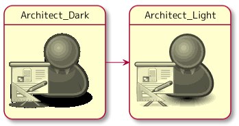
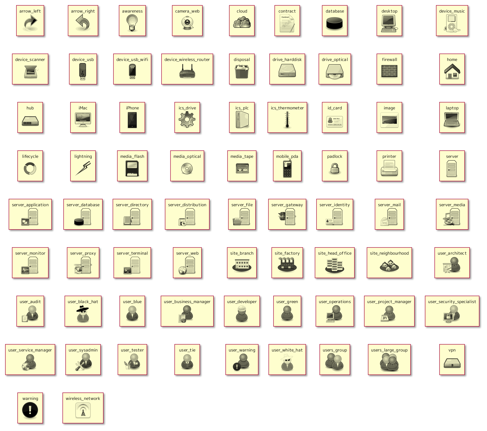

# osa_puml
Yet another OSA icons for PlantUML

An original [OSA Icon Library](https://www.opensecurityarchitecture.org/cms/library/icon-library) is available under [the Creative Commons share-alike license](https://www.opensecurityarchitecture.org/cms/about/license-terms). OSA icons for [PlantUML](https://github.com/plantuml/plantuml) are also already [available](https://github.com/Crashedmind/PlantUML-opensecurityarchitecture-icons). I prefer lighter shadows in the icons, so I made another conversion. According to [the instructions](https://github.com/Crashedmind/PlantUML-opensecurityarchitecture-icons/blob/master/README.md), I used the python script [puml.py](https://github.com/milo-minderbinder/AWS-PlantUML/blob/master/puml.py) to convert icons.


## Usage example
    ```puml
    !include <osa/user/green/architect/architect>
    Architect_Dark: <$architect>

    !$OSA = "./osa"
    !include $OSA/user_architect.puml
    Architect_Light: <$user_architect>

    Architect_Dark -r-> Architect_Light
    ```



## All icons


## License
The icons provided here are available under the CC-BY-SA licence ([LICENSE](./LICENSE) file). Code is available under the MIT license ([LICENSE-CODE](./LICENSE-CODE) file)

## Acknowledgements
* [PlantUML Open security Architecture Icons](https://github.com/Crashedmind/PlantUML-opensecurityarchitecture-icons) - for the converting instructions.
* [AWS-PlantUML](https://github.com/milo-minderbinder/AWS-PlantUML) - for the converting script.
* [PlantUML](https://github.com/plantuml/plantuml) - for the tool to draw diagrams quickly and easily.
